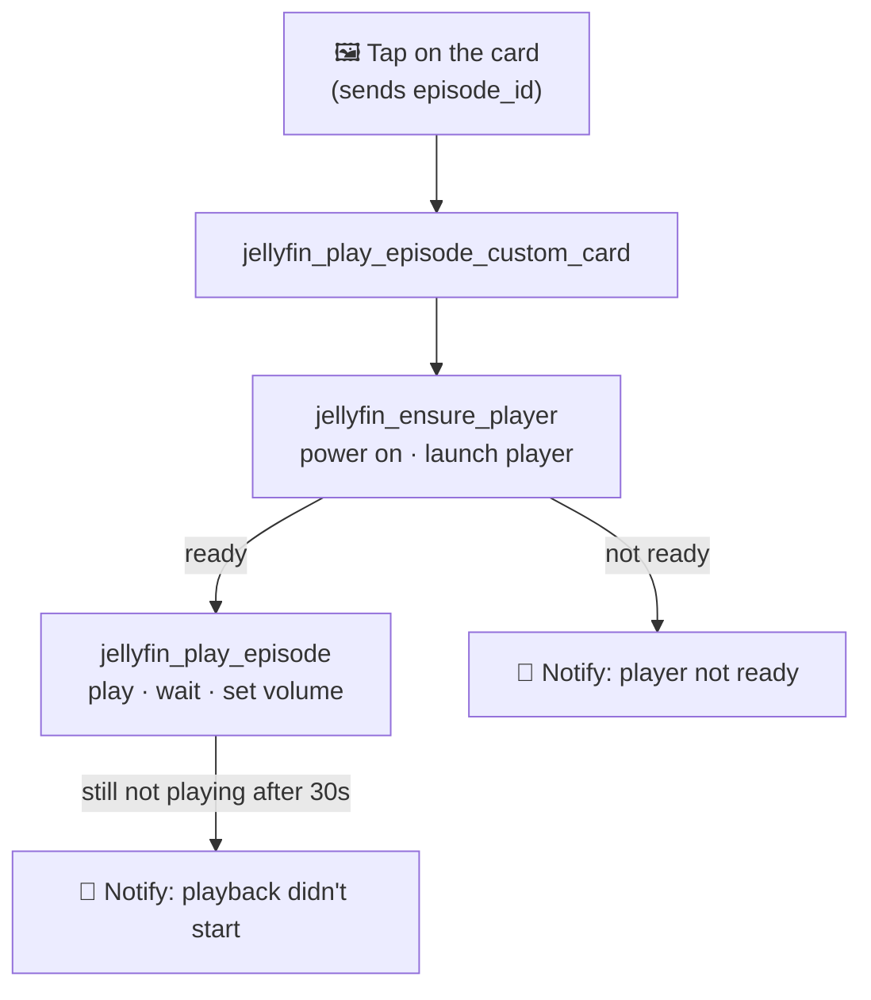

<div align="center">

# 📺 Jellyfin Media Card — Play

**The playback layer for the [Jellyfin Media Card](https://github.com/a4happy20/jellyfin-media-card).**

It's centered on one file, `jellyfin_play.yaml`: the script the card calls when you tap an
item, plus helpers for the target player and volume. Getting the device ready first is
handled by a small readiness script you provide — and a working example is included.

[](LICENSE)
[](https://www.home-assistant.io/docs/configuration/packages/)

</div>

---

> [!IMPORTANT]
> **This is a Home Assistant configuration _package_ — not an integration and not a HACS
> add-on.** You copy the YAML into your own configuration and (optionally) turn on Home
> Assistant's packages feature.
> 👉 [Configuration packages — Home Assistant docs](https://www.home-assistant.io/docs/configuration/packages/)

<br>

## Contents

- [What is this?](#what-is-this)
- [The pieces](#the-pieces)
- [Requirements](#requirements)
- [Connect it to the card](#connect-it-to-the-card)
- [What it creates](#what-it-creates)
- [Setup](#setup)
  - [Step 0 — Enable packages *(once)*](#step-0--enable-packages-once)
  - [Step 1 — Add the package file](#step-1--add-the-package-file)
  - [Step 2 — Tell it which players you have](#step-2--tell-it-which-players-you-have)
  - [Step 3 — Set your notification target](#step-3--set-your-notification-target)
  - [Step 4 — Provide the readiness script](#step-4--provide-the-readiness-script)
  - [Step 5 — Check config & restart](#step-5--check-config--restart)
- [How playback works](#how-playback-works)
- [Troubleshooting](#troubleshooting)
- [License](#license)

<br>

## What is this?

When you tap an item on the Jellyfin Media Card, the card doesn't play anything by itself —
it just calls a **script** and passes along the item's ID. This repo *is* that script (and
its supporting helpers).

Give it an episode ID and it will:

1. Make sure your player is ready — via a readiness script you provide (there's an example
   that turns on a PC and opens Jellyfin in a browser).
2. Play the episode on that player.
3. Set the volume, and warn you if playback never actually started.

<br>

## The pieces

This is one of three repos that make up the project. You only need this one if you want
tap-to-play:

| Repo | Role | Required? |
|---|---|---|
| [jellyfin-media-card](https://github.com/a4happy20/jellyfin-media-card) | The Lovelace card (the front end) | ✅ Yes |
| [jellyfin-media-card-sensors](https://github.com/a4happy20/jellyfin-media-card-sensors) | The data backend (feeds the card) | ✅ Yes |
| **jellyfin-media-card-play** *(this repo)* | The playback layer (tap-to-play) | Optional |

<br>

## Requirements

To play anything, Home Assistant needs a **`media_player` entity that represents your
Jellyfin client**. The built-in **Jellyfin integration** provides exactly that.

**Set up the Jellyfin integration (once):**

1. Go to **Settings → Devices & services → Add Integration**, then search for **Jellyfin**.
2. Enter your server address **including the protocol** — e.g. `http://192.168.1.10:8096`
   (leaving off `http://` is the most common reason setup fails).
3. Sign in and finish the prompts.

Once it's set up, Home Assistant creates **one `media_player` entity per Jellyfin client
that connects to your server** — for example, a browser running Jellyfin Web shows up as
something like `media_player.jellyfin_brave`. That entity name is what you'll list in
[Step 2](#step-2--tell-it-which-players-you-have).

> [!IMPORTANT]
> A client only appears as a `media_player` **while it's connected** to the server. If the
> Jellyfin app or browser tab on your device isn't open, its entity won't be available to
> play to. That's what the readiness script in
> [Step 4](#step-4--provide-the-readiness-script) is for — it launches the client on your
> device so the entity is there and ready.

<br>

## Connect it to the card

This is the whole point, so here it is up front. In your card's configuration, set
`play_script` to this repo's entry-point script:

```yaml
type: custom:jellyfin-media-card
entity: sensor.jellyfin_recent_card_data
play_script: script.jellyfin_play_episode_custom_card
```

**How the ID gets there:** when you tap an item, the card sends its ID to the script under
the field name set by the card's `id_field` option (default `episode_id`). The script
receives that `episode_id` and plays it. So as long as `id_field` on the card is
`episode_id`, the two line up automatically — no extra wiring needed.

<br>

## What it creates

| Entity / script | Type | Purpose |
|---|---|---|
| `input_select.jellyfin_media_player` | helper | Which media player to play on |
| `input_number.jellyfin_volume` | helper | Default playback volume (0–100%) |
| `script.jellyfin_play_episode_custom_card` | script | **Card entry point** — runs your readiness script, then plays |
| `script.jellyfin_play_episode` | script | Plays an episode by ID, sets volume, warns if playback didn't start |

> [!NOTE]
> The entry-point script also calls `script.jellyfin_ensure_player` to get your device ready
> first. That script lives **outside** `jellyfin_play.yaml` because it's specific to your
> hardware — see [Step 4](#step-4--provide-the-readiness-script) for the included example and
> your options.

<br>

## Setup

**The whole process in a nutshell:**

1. Drop the package file into Home Assistant.
2. Point the card's `play_script` at `script.jellyfin_play_episode_custom_card` *(see [above](#connect-it-to-the-card))*.
3. List your media players and pick a default volume.
4. Set your notification target (or remove the notify steps).
5. Provide a readiness script — use the included example, adapt it, or skip it.
6. Check the config and restart.

Each step is spelled out below. 👇

<br>

### Step 0 — Enable packages *(once)*

<details>
<summary><b>Show me how to enable packages</b></summary>

<br>

> 📖 Reference: [Configuration packages — Home Assistant docs](https://www.home-assistant.io/docs/configuration/packages/)

In your `configuration.yaml`, tell Home Assistant to load a `packages` folder:

```yaml
homeassistant:
  packages: !include_dir_named packages
```

*(If you already have a `homeassistant:` block, just add the `packages:` line under it.)*

</details>

> [!TIP]
> Prefer not to use packages? You can drop the `input_select`, `input_number`, and `script`
> blocks wherever they normally live in your configuration instead.

<br>

### Step 1 — Add the package file

Copy `jellyfin_play.yaml` into your `config/packages/` folder. That's the only file you need.

<br>

### Step 2 — Tell it which players you have

Edit the options under `input_select.jellyfin_media_player` so they list *your* media
players. The one shown is just an example:

```yaml
input_select:
  jellyfin_media_player:
    name: Jellyfin Media Player
    options:
      - "media_player.jellyfin_brave"   # example — replace with yours
      # add more players here as options
```

The `input_number.jellyfin_volume` helper sets the default playback volume (0–100%). You
can leave it as-is.

> [!NOTE]
> These entity names come from the Jellyfin integration (see [Requirements](#requirements)).
> To find yours, open **Developer Tools → States** and look for entities starting with
> `media_player.jellyfin_`.

<br>

### Step 3 — Set your notification target

The scripts send a heads-up notification if playback doesn't start. Replace
`notify.mobile_app_YOUR_PHONE` (it appears **twice**) with your own mobile-app notify
service — or delete those notify steps if you don't want them.

<br>

### Step 4 — Provide the readiness script

`jellyfin_play_episode_custom_card` calls `script.jellyfin_ensure_player` first, to get your
device powered on and its Jellyfin client running — otherwise there's no `media_player`
entity to play to (see [Requirements](#requirements)). This script **isn't part of
`jellyfin_play.yaml`**, because how you wake and launch a device is entirely specific to your
hardware.

**A working example is included.** `jellyfin_ensure_player.yaml` demonstrates one real setup:
turning on a Windows PC and opening Jellyfin in a browser.

<details>
<summary><b>What the example does</b></summary>

<br>

It defines three scripts:

| Script | What it does |
|---|---|
| `jellyfin_ensure_player` | Looks at your `input_select` choice and, for the browser player, runs the two helpers below — then reports whether it's `ready`. |
| `ensure_pc_is_on` | Turns the PC on via a switch (`switch.my_computer`) and waits for it to come on. |
| `jellyfin_open_browser` | Sends an MQTT command (via **HASS.Agent** running on the PC) to open the Jellyfin web page, then waits for the `media_player` entity to come online. |

The device-specific bits — the switch entity, the MQTT topic, and the Jellyfin URL — are specific to your hardware. Swap in your own.

</details>

You have three ways to handle this step:

- **Start from the example.** Copy `jellyfin_ensure_player.yaml` into `config/packages/`, then
  change the switch, MQTT topic, and URL to match your setup.
- **Write your own.** Create a `jellyfin_ensure_player` script that gets *your* device ready
  and returns `ready: true`. For instance, Wake-on-LAN for a PC, or a power/app-launch action
  for a smart TV.
- **Skip readiness.** If your player is always on with the Jellyfin client already running,
  remove the `script.jellyfin_ensure_player` call from `jellyfin_play_episode_custom_card` and
  it'll play directly.

<br>

### Step 5 — Check config & restart

Go to **Developer Tools → YAML → Check Configuration** (or run `ha core check`), fix
anything it flags, then **restart Home Assistant**.

<br>

## How playback works

Here's what happens from the moment you tap an item:



Step by step:

1. The card calls `jellyfin_play_episode_custom_card` with the item's `episode_id`.
2. That runs `jellyfin_ensure_player` — the readiness script you provide (example included) —
   which powers on and launches your chosen player, then reports whether it's ready.
3. If ready, `jellyfin_play_episode` plays the episode, waits a moment, sets the volume
   from `input_number.jellyfin_volume`, and — if playback still hasn't started after 30
   seconds — sends a fallback notification.

<br>

## Troubleshooting

<details>
<summary><b>"Player not ready" notification</b></summary>

<br>

`jellyfin_ensure_player` reported the device isn't ready. Make sure the device is on and its
Jellyfin client is running, and that your readiness script from
[Step 4](#step-4--provide-the-readiness-script) returns `ready: true`. If your player is
always on, you can skip readiness altogether (also in Step 4).
</details>

<details>
<summary><b>"Playback didn't start" notification</b></summary>

<br>

The player was reachable but didn't begin playing within 30 seconds. Confirm the selected
`media_player` can play Jellyfin content by ID, and that the ID coming from your sensor is
valid.
</details>

<details>
<summary><b>Nothing happens when I tap</b></summary>

<br>

Check that the card's `play_script` is set to `script.jellyfin_play_episode_custom_card`
and that its `id_field` is `episode_id` (see [Connect it to the card](#connect-it-to-the-card)).
</details>

<details>
<summary><b>Config check fails</b></summary>

<br>

YAML is whitespace-sensitive — indentation errors are the usual cause. Read the exact line
the check points to, and make sure you're using spaces (not tabs).
</details>

<br>

## License

Licensed under the [GNU General Public License v3.0](LICENSE)
